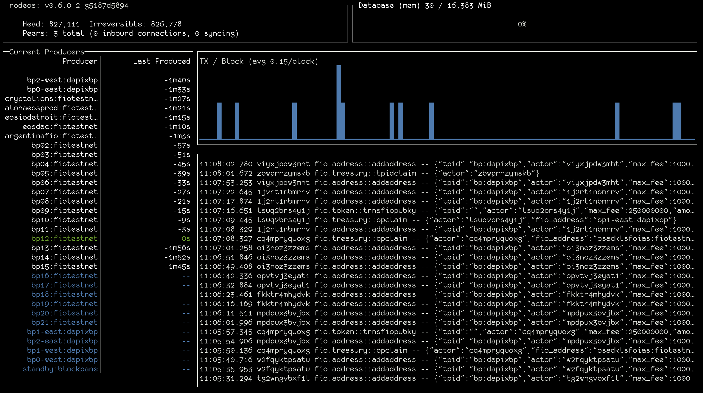

# fiotop

A simple utility for watching the state of a node. Shows some basic net
info, peer info (if the net_api_plugin is enabled), database size (if
the db_size_api_plugin is enabled), list of producers, and an event stream.

Default is to connect to `http://localhost:8888` to specify a different
nodeos server, run with the `-u` option.



```
Keys:
    ? or F1 for help screen
    q or CTRL-C to exit
    r or CTRL-L to repaint screen
    d or CTRL-U to clear data
```
